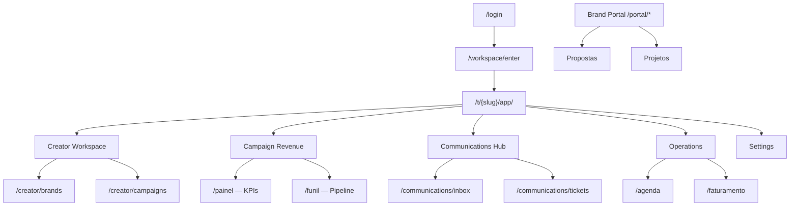

# Inventário Técnico — GlowUP

> **Etapa 2 (Descoberta e inventário)** do plano de migração  
> Última atualização: julho/2026

Inventário completo de rotas, componentes, dependências, tokens de estilo e modelos de dados do projeto atual, base para a migração CRM → Plataforma de Influenciadores.

---

## 1. Stack e estrutura do projeto

| Camada | Tecnologia |
| --- | --- |
| Framework | React 19 + TypeScript 5.8 |
| Roteamento | TanStack Router (file-based em `src/routes/`) |
| SSR / API | TanStack Start (`createServerFn`) |
| Estado | React Context + TanStack Query |
| Estilo | Tailwind CSS 4 + shadcn/ui (new-york) |
| Banco | SQLite via Drizzle ORM |
| Testes | tsx (unit) + Playwright (E2E) |
| Build | Vite 7 |

```
GlowUP/
├── src/
│   ├── routes/              # Todas as páginas (TanStack Router)
│   ├── components/          # UI compartilhada + domínio
│   ├── modules/
│   │   ├── creator/         # Marcas, campanhas, agências, patrocinadores
│   │   └── communications/  # Hub omnichannel (inbox, tickets, providers)
│   ├── layouts/             # app-layout, portal-layout, admin-layout
│   ├── lib/                 # CRM store, auth, db, pipelines, API
│   ├── hooks/
│   └── styles.css           # Design tokens (Tailwind v4)
├── e2e/                     # Playwright (12 specs)
├── data/                    # SQLite (vendapro.sqlite)
├── types/                   # Tipos alvo da plataforma de influenciadores
├── schemas/                 # JSON Schema para validação
├── migrations/              # Scripts de migração de dados
└── docs/                    # Documentação de migração
```

**Nota:** Não existe pasta `src/pages/` — todas as telas estão em `src/routes/`.

---

## 2. Rotas (49 rotas canônicas)

Geradas automaticamente em `src/routeTree.gen.ts`.

### Autenticação e entrada

| Rota | Arquivo | Descrição |
| --- | --- | --- |
| `/` | `routes/index.tsx` | Redirect auth-aware |
| `/login` | `routes/login.tsx` | Login split-screen |
| `/workspace/enter` | `routes/workspace/enter.tsx` | Entrada no workspace |

### Redirects legados (→ tenant app)

| Rota legada | Destino |
| --- | --- |
| `/painel` | `/t/demo/app/painel` |
| `/funil` | `/t/demo/app/funil/pipeline-vendas` |
| `/agenda`, `/chats`, `/emails`, `/propostas`, `/configuracoes` | Equivalentes no tenant |

### Admin SaaS (`/admin/*`)

| Rota | Arquivo | Tela |
| --- | --- | --- |
| `/admin` | `admin/index.tsx` | Dashboard admin |
| `/admin/billing` | `admin/billing.tsx` | Faturamento SaaS |
| `/admin/tenants` | `admin/tenants/index.tsx` | Lista de tenants |
| `/admin/tenants/$tenantId` | `admin/tenants/$tenantId.tsx` | Detalhe tenant |

### App tenant (`/t/$tenantSlug/app/*`)

Layout: `routes/t/$tenantSlug/app/route.tsx` → `AppLayout` + `CrmProviderWithTenant`

| Rota | Arquivo | Tela / dados |
| --- | --- | --- |
| `/app/` | `app/index.tsx` | Redirect → painel |
| `/app/painel` | `app/painel.tsx` | Dashboard receita (KPIs, charts) |
| `/app/funil/` | `app/funil/index.tsx` | Seletor de pipeline |
| `/app/funil/$pipelineId` | `app/funil/$pipelineId.tsx` | Kanban board |
| `/app/agenda` | `app/agenda.tsx` | Calendário + tarefas |
| `/app/propostas` | `app/propostas.tsx` | Propostas comerciais |
| `/app/chamados` | `app/chamados.tsx` | Suporte (Chamado legado) |
| `/app/faturamento` | `app/faturamento.tsx` | Faturas |
| `/app/configuracoes` | `app/configuracoes.tsx` | Settings + equipe |
| `/app/comunicacao` | `app/comunicacao.tsx` | Redirect → inbox |
| `/app/chats`, `/app/emails` | — | Redirect → inbox |

#### Creator module (`/app/creator/*`)

| Rota | Componente | Dados |
| --- | --- | --- |
| `/creator/` | `CreatorDashboard` | `CreatorSnapshot` |
| `/creator/brands` | `BrandsPage` | `Brand[]` |
| `/creator/agencies` | `AgenciesPage` | `Agency[]` |
| `/creator/sponsors` | `SponsorsPage` | `Sponsor[]` |
| `/creator/campaigns` | `CampaignsPage` | `Campaign[]` |

#### Communications hub (`/app/communications/*`)

| Rota | Componente |
| --- | --- |
| `/communications/inbox` | `InboxPage` → `InboxLayout` |
| `/communications/tickets` | `TicketListPage` |
| `/communications/channels` | `ChannelStatusGrid` |
| `/communications/integrations` | `IntegrationsPage` |
| `/communications/reports` | `CommunicationsDashboard` |
| `/communications/settings` | `CommunicationsSettings` |

### Brand portal (`/t/$tenantSlug/portal/*`)

Layout: `PortalLayout` — escopo por `clientId`

| Rota | Tela |
| --- | --- |
| `/portal/` | Home portal |
| `/portal/propostas` | Propostas da marca |
| `/portal/projetos` | Projetos |
| `/portal/faturamento` | Faturamento |
| `/portal/chamados` | Suporte |

---

## 3. Componentes

### Shell e navegação (`src/components/`)

| Componente | Propósito |
| --- | --- |
| `app-sidebar.tsx` | Sidebar principal |
| `app-sidebar-creator-group.tsx` | Grupo Creator no menu |
| `app-sidebar-comunicacoes-group.tsx` | Grupo Comunicações |
| `app-sidebar-posvenda-group.tsx` | Grupo pós-venda |
| `app-breadcrumbs.tsx` | Breadcrumbs |
| `theme-toggle.tsx` | Toggle dark/light |

### Domínio CRM

| Componente | Propósito |
| --- | --- |
| `pipelines/pipeline-board.tsx` | Kanban DnD |
| `pipelines/pipeline-column.tsx` | Coluna do pipeline |
| `pipelines/pipeline-card.tsx` | Card do pipeline |
| `propostas/proposta-generator.tsx` | Gerador PDF de propostas |
| `comunicacao/chats-panel.tsx` | Painel chat legado |
| `comunicacao/emails-panel.tsx` | Painel email legado |
| `login/login-pipeline-panel.tsx` | Visual split-screen login |
| `settings/team-section.tsx` | Gestão de equipe |
| `tenant/white-label-settings.tsx` | White-label por tenant |

### Portal (`src/components/portal/`)

`portal-nav.tsx`, `portal-status-badge.tsx`, `portal-empty-state.tsx`

### shadcn/ui (`src/components/ui/`) — 40+ primitivos

`accordion`, `alert`, `avatar`, `badge`, `button`, `calendar`, `card`, `chart`, `dialog`, `drawer`, `dropdown-menu`, `form`, `input`, `select`, `sidebar`, `table`, `tabs`, `tooltip`, etc.

### Módulo Creator (`src/modules/creator/components/`)

`creator-dashboard.tsx`, `brands-page.tsx`, `agencies-page.tsx`, `sponsors-page.tsx`, `campaigns-page.tsx`, `creator-sub-nav.tsx`, `dashboard-stat-card.tsx`

### Módulo Communications (`src/modules/communications/components/`)

| Área | Componentes |
| --- | --- |
| Inbox | `inbox-layout`, `conversation-list`, `conversation-thread`, `message-composer`, `channel-filter-bar` |
| Tickets | `ticket-list`, `ticket-detail`, `internal-note-panel` |
| Channels | `channel-status-grid` |
| Integrations | `integrations-page`, `provider-card`, `provider-config-form` |
| Reports | `communications-dashboard`, `metrics-charts` |
| Shared | `attachment-preview`, `role-badge`, `communications-sub-nav` |

### Layouts

| Layout | Uso |
| --- | --- |
| `app-layout.tsx` | Shell principal tenant |
| `portal-layout.tsx` | Portal da marca |
| `admin-layout.tsx` | Admin SaaS |

**Total estimado:** 76+ arquivos em `src/components/` + módulos.

---

## 4. Tokens de estilo

**Tailwind v4** — tokens em `src/styles.css` via `@theme inline`. Não existe `tailwind.config.ts`.

### Brand tokens

| Token | Valor |
| --- | --- |
| `--radius` | `0.625rem` |
| `--glowup-gradient` | `linear-gradient(135deg, oklch(0.62 0.24 310) → oklch(0.68 0.22 350))` |
| `--glowup-accent` | `oklch(0.72 0.2 350)` |

### Cores semânticas (oklch)

| CSS variable | Utility Tailwind | Uso |
| --- | --- | --- |
| `--background`, `--foreground` | `bg-background`, `text-foreground` | Base da página |
| `--primary` | `bg-primary`, `text-primary` | Ações (violet ~310°) |
| `--secondary` | `bg-secondary` | Superfícies secundárias |
| `--muted` | `bg-muted`, `text-muted-foreground` | Texto/bg sutil |
| `--accent` | `bg-accent` | Destaques |
| `--destructive` | `bg-destructive` | Erros |
| `--border`, `--input`, `--ring` | `border-border`, `ring-ring` | Bordas/foco |
| `--chart-1` … `--chart-5` | `text-chart-*` | Recharts |
| `--sidebar-*` | Sidebar tokens | Navegação |

### White-label por tenant

`src/lib/tenant/defaults.ts` — overrides de `primary`, `primaryForeground`, `accent` por tenant via `apply-theme.ts`.

### shadcn config (`components.json`)

- Style: `new-york`
- Base color: `slate`
- CSS variables: `true`
- Icons: `lucide`

---

## 5. Modelos de dados e persistência

### Persistência

| Tabela Drizzle | Conteúdo |
| --- | --- |
| `tenants` | Metadados do tenant |
| `users` | Usuários |
| `tenant_memberships` | Membros por tenant |
| `tenant_crm_state` | JSON blob → `TenantCrmSnapshot` |

### TenantCrmSnapshot (`src/lib/db/types.ts`)

```typescript
{
  leads, tarefas, emails, conversas, propostas,
  chamados, faturas, pipelineItems, usuarios,
  configuracoes?, communications?, creator?
}
```

### Tipos CRM legados (`src/lib/types.ts`)

| Tipo | Campos principais |
| --- | --- |
| `Lead` | id, cliente, contato, email, telefone, valor, etapa, prioridade, timeline |
| `Tarefa` | id, titulo, responsavelId, prazo, concluida, leadId |
| `Proposta` | id, numero, cliente, valor, status, itens, leadId, clientId |
| `Chamado` | id, titulo, descricao, status, clientId |
| `Fatura` | id, numero, valor, vencimento, status, clientId |
| `Conversa` / `Mensagem` | chat legado |
| `EmailMsg` | email legado |
| `Usuario` | id, nome, email, papel |
| `PipelineItem` | id, pipelineId, stageId, titulo, dados, timeline |

### Creator module (`src/modules/creator/domain/entities.ts`)

`Brand`, `Agency`, `Sponsor`, `Campaign`, `CreatorSnapshot`

### Communications (`src/modules/communications/domain/entities.ts`)

`Conversation`, `Message`, `Ticket`, `Attachment`, `ProviderConfig`, `CommunicationsSnapshot`

---

## 6. Server functions (API)

Não há REST `/api/*` — API via TanStack Start `createServerFn`:

| Módulo | Funções | Método |
| --- | --- | --- |
| `auth.functions.ts` | login, logout, getSession | POST/GET |
| `crm.functions.ts` | getCrmState, saveCrmState, addChamado | GET/POST |
| `tenants.functions.ts` | listTenants, createTenant, updateTenant, deleteTenant, getTenantBySlug, getPlatformMetrics | GET/POST |
| `team.functions.ts` | listTeamMembers, inviteTeamMember, removeTeamMember, updateMemberRole | GET/POST |
| `communications.functions.ts` | getCommunicationsState, saveCommunicationsState | GET/POST |

**Client-side fallback:** `src/lib/crm-store.tsx` — localStorage (`vendapro_crm_state_v3_{tenantId}`).

---

## 7. Mock data

| Arquivo | Conteúdo |
| --- | --- |
| `src/lib/mock-data.ts` | Leads, tarefas, emails, conversas, propostas, chamados, faturas |
| `src/modules/creator/data/mock-creator-data.ts` | Brands, agencies, sponsors, campaigns |
| `src/lib/platform-mock-data.ts` | Tenants SaaS, invoices, activity feed |
| `src/lib/clients-registry.ts` | `ClientRecord[]` (portal marcas) |
| `src/lib/auth/mock-users.ts` | Usuários demo |

---

## 8. Dependências (package.json)

### Runtime principais

React 19, TanStack Router/Start/Query, Tailwind 4, Radix UI, shadcn, Recharts, @dnd-kit, date-fns, zod, drizzle-orm, better-sqlite3, jose, bcryptjs, jspdf

### Dev

Vite 7, ESLint, Prettier, Playwright, drizzle-kit, TypeScript 5.8

### Scripts de teste

```bash
npm test              # Unit tests (pipelines, admin, db, navigation, comms, creator)
npm run test:e2e      # Playwright E2E
npm run db:seed       # Seed SQLite
```

---

## 9. Mapa de fluxo de usuário



---

## 10. Telas críticas para screenshots

Capturas recomendadas em `docs/screenshots/` (ver README da pasta):

| Tela | Rota | Prioridade |
| --- | --- | --- |
| Login | `/login` | Alta |
| Creator Dashboard | `/t/demo/app/creator/` | Alta |
| Pipeline vendas | `/t/demo/app/funil/pipeline-vendas` | Alta |
| Inbox unificada | `/t/demo/app/communications/inbox` | Alta |
| Painel receita | `/t/demo/app/painel` | Média |
| Campanhas | `/t/demo/app/creator/campaigns` | Média |
| Brand portal | `/t/demo/portal/` | Média |
| Configurações | `/t/demo/app/configuracoes` | Baixa |

---

## 11. Documentação existente

| Arquivo | Conteúdo |
| --- | --- |
| `README.md` | Posicionamento, stack, terminologia |
| `src/routes/README.md` | Convenções TanStack Router |
| `src/modules/creator/CREATOR_DOMAIN_MIGRATION.md` | Mapeamento CRM→Creator, ~85% dependência legado |
| `src/modules/communications/ARCHITECTURE.md` | Arquitetura do hub |
| `src/modules/communications/domain/DATA_MODEL.md` | Modelo dual-write |
| `.cursor/plans/change.plan.md` | Plano completo de migração |
| `docs/entity-mapping.md` | Mapeamento de entidades (Etapa 1) |
| `migration-plan.md` | Plano de migração de campos (Etapa 2) |
| `api-contracts.md` | Contratos de API alvo (Etapa 3) |

---

## 12. Dependência legado vs. Creator

Segundo `CREATOR_DOMAIN_MIGRATION.md`:

| Camada | Status |
| --- | --- |
| Modelo de dados | 100% legado (`Lead`, `clientId`, etc.) |
| Rotas | 100% legado (paths preservados) |
| Permissões | 100% legado |
| Labels UI | ~58% relabeladas via `terminology.ts` |
| Módulo Creator | Parcial — entidades alvo existem, sem migração de dados |
| Communications Hub | Funcional — padrão dual-write implementado |

**Próximo passo recomendado:** adapters de dual-write + feature flag `VITE_CREATOR_DOMAIN_READ` (ver `migration-plan.md`).
